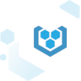
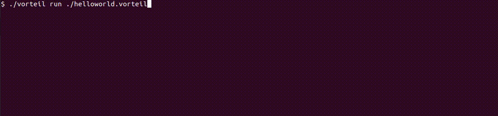

<br />
<p align="center">
  <a href="https://github.com/vorteil/vorteil">
    
  </a>
  <h3 align="center">vorteil.io</h3>
    <h5 align="center">turn your applications and containers into micro virtual machines</h5>
</p>
<hr/>

[](https://travis-ci.org/vorteil/vorteil) <a href="https://codeclimate.com/github/vorteil/vorteil/maintainability"></a> <a href="https://codeclimate.com/github/vorteil/vorteil/test_coverage"></a> [](https://goreportcard.com/report/github.com/vorteil/vorteil)

Vorteil is an operating system for running cloud applications on micro virtual machines. It takes only the files you need and runs them on a custom Linux kernel without any unnecessary background services: there's no ssh, no shell, and no login; just a toml file that Vorteil's init process (vinitd) uses to configure the system and launch your apps.

<p align="center">
  <a href="https://github.com/vorteil/vorteil">
    
  </a>
</p>

The tools that build Vorteil images have been optimized for speed, and can take your project from loose files to a running virtual machine in as little as one second.

## Installation

The Vorteil binary runs anywhere, just download the archive for your system, extract it, and put the executable on your `PATH`.

### Linux
```
wget https://github.com/vorteil/vorteil/releases/latest/download/vorteil_linux-x86.tar.gz
tar -xzf vorteil_linux-x86.tar.gz
./vorteil --help
```

### Dependencies

To use the `vorteil run` command you'll need VirtualBox, QEMU, or Hyper-V installed on your system and reachable on the `PATH`.

If you're using Windows, it's recommended that you enable developer mode as well, so that the tools can use Unix-style symlinks.

## Using Vorteil

### Hello World

```
vorteil run https://apps.vorteil.io/file/vorteil/helloworld
```

This command downloads our Hello World package from apps.vorteil.io and runs it using one of your local hypervisors.

Our Hello World app is a simple web server that should be reachable via NAT on port 8888 (http://localhost:8888/). If that port was unavailable you should notice a yellow warning message in the logs telling you which port it bound instead.

### Convert a Docker Container

TODO: quick example

### Modify an Existing Package

```
wget -o cockroachdb.vorteil https://apps.vorteil.io/file/vorteil/cockroachdb
vorteil unpack cockroachdb.vorteil cockroachdb
ls cockroachdb
```

These commands download a Vorteil package and use the `vorteil unpack` command to extract its contents into a structured Vorteil project directory. Think of this directory like it will become the root directory on your app's virtual machine. You can modify the app's file-system contents by changing the files in this directory.

There are two types of special files in the project directory: `.vorteilproject` and files that end with the `.vcfg` file extension. These are used by Vorteil to understand how to build the virtual machine and what it should do when it's running.

Make whatever changes you need to make, then repackage them.

```
vorteil pack cockroachdb -o cockroachdb-modified.vorteil
```

This `vorteil pack` command packs up your project directory into a package file again.

```
vorteil run cockroachdb-modified.vorteil
```

Try out your modified package by using the `vorteil run` command on it.

### Making Your Own Package

TODO: link to a superior article / docs

## Need Help?

TODO: link to our support portal and/or chat rooms?

## Building From Source

These tools are 100% written in Go, which means compiling them is the same as compiling most simple Go programs.

```
go build github.com/vorteil/vorteil/cmd/vorteil
```

### Contributing

TODO: flesh this out

## License

Distributed under the Apache 2.0 License. See `LICENSE` for more information.

## See Also

* The [Vorteil.io](https://vorteil.io/) website.
* The Vorteil [documentation](https://support.vorteil.io/).
* The free Vorteil [apps repository](http://apps.vorteil.io/).
* The Vorteil [blog](https://blog.vorteil.io/).
* The [Godoc](https://godoc.org/github.com/vorteil/vorteil) library documentation.
